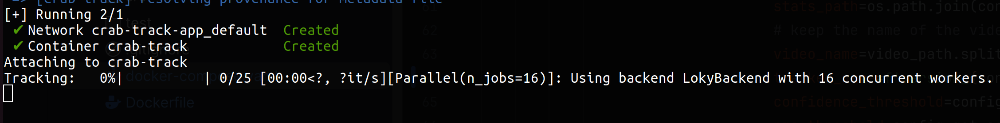

# Crab Tracker


This Python application uses YOLO (You Only Look Once) from the `ultralytics` library to detect and track crabs in video feeds or images. YOLO is a real-time object detection system, and with the latest advancements in `ultralytics`, we can achieve efficient and accurate detection of crabs for research, environmental monitoring, or other applications.

## Table of Contents

- [Features](#features)
- [Installation](#installation)
- [Setup](#setup)
  - [Local](#local)
  - [Docker](#docker)
- [Usage](#usage)
  - [Local](#local)
  - [Docker](#docker)
  - [Console output](#console-output)
- [Output](#output)
  - [Files](#files)
  - [Csv data](#csv-data)

## Features

- Real-time crab detection using YOLO from the `ultralytics` library.
- Configurable for different image and video sources.
- Options to save detection results as videos.
- Adjustable parameters to improve detection accuracy.
- Missing points are interpolated using the previous and next points.

## Installation

1. **Clone the Repository**
   ```bash
   git clone https://github.com/mmartiasg/crab-track-app.git
   cd crab-track-app

## Setup

### Local
1. **Create a local environment**
    ```bash
      python3 -m venv /path/to/virtualenv/name_virtual_env
    ```
   Example:
    ```bash
      python3 -m venv ~/python_envs/crab-track
    ```

2. **Activate the environment**
   ```bash
      source /path/to/virtualenv/name_virtual_env/bin/activate
    ```
   Example:
    ```bash
      source ~/python_envs/crab-track/bin/activate
    ```

3. **Set Up the configuration file**
   ```yaml
      model:
        path: # Model weight's path.
        conf_threshold: # Desired confidence threshold from 0.0 up to 1.0.
        nms_threshold: # Desired iou overlap threshold from 0.0 up to 1.0.
        device: # Device cpu, cuda or mps.
      input:
        path: # Absolute path where the videos are located in the current file system.
        extension: mp4 # Video extension.
      output:
        export_videos: false # If false the video samples with the boundary box will not be saved.
        path: # Absolute path where the results will be saved in the current file system.
        disable_progress_bar: true # If true the progress bar per each video will be supress.
   ```

### Docker
1. **Install Docker client**
Find your distribution installer here [Docker desktop](https://www.docker.com/products/docker-desktop/)

2. **Configuration**
   ```yaml
      model:
        path: # Model weight's path.
        conf_threshold: # Desired confidence threshold from 0.0 up to 1.0.
        nms_threshold: # Desired iou overlap threshold from 0.0 up to 1.0.
        device: # Device cpu, cuda or mps.
      input:
        path: /dataset/samples # !Do not change this! This is the docker path where the input will be mapped (target)!
        extension: mp4 # Video extension.
      output:
        export_videos: false # If false the video samples with the boundary box will not be saved.
        path: /results # !Do not change this! This is the docker path where the output will be mapped (target).
        disable_progress_bar: true # If true the progress bar per each video will be supress.
   ```

    💡**Hint:** I have provided a sample for each case that you can use as initial template in the config folder.
    A base model has been provided in **models**:
    the onnx versions is already optimize for a fast cpu inference while the .pt is the raw model from pytorch unoptimized.
    ```
    Project
    ├-- README.md
    |-- config
    │   ├-- run_conf_sample_docker.yaml
    │   |-- run_conf_sample_local.yaml
    |-- models
        |--0.2.0
            |-- tracking.onnx
            |-- tracking.pt
    ```

3. **Docker compose configuration**
The important part is the **volumes** section
   ```yaml
    volumes:
      - type: bind # Do not change!
        source: # Change to the folder in the local file system where the videos are located.
        target: /dataset/samples # Do not change!
      - type: bind # Do not change! 
        source: # Change to an existing folder where you want the results to be saved.
        target: /results # Do not change!
   ```

## Usage
### Local
```bash
    python main.py --config_path=config/run_conf.yaml
```

### Docker
```bash
      docker compose -f docker-compose.yaml up --build
```

## Console output:


## Output

### Files
The output will be saved in the folder selected in the case of the local in **output -> path** in the case of the Docker 
in the **volumes -> target** of the second entry. A .csv and a video if **output -> export_videos is true** will be saved in stats and videos folders respectively.

For example if we have just one video called 1.mp4 after the process has finished in the results folder we can find:
```
Project
├-- README.md
|-- results
│   ├-- stats
        |-- 1.csv
│   |-- videos
        |-- 1.mp4
```

### Csv data

| Index | pred_bbox_x1 | pred_bbox_y1 | pred_bbox_x2 | pred_bbox_y2 |
|-------|--------------|--------------|--------------|--------------|
| 0     | 1311         | 985          | 1526         | 1073         |
| 1     | 1312         | 983          | 1528         | 1072         |
| 2     | 1312         | 984          | 1526         | 1074         |
| 3     | 1313         | 982          | 1528         | 1072         |
| 4     | 1313         | 982          | 1528         | 1071         |
| 5     | 1312         | 983          | 1527         | 1073         |
| 6     | 1310         | 985          | 1525         | 1075         |

**Column Descriptions:**
- **Index**: The nth frame in the sequence.
- **pred_bbox_x1** and **pred_bbox_y1**: Upper-left corner coordinates of the bounding box.
- **pred_bbox_x2** and **pred_bbox_y2**: Lower-right corner coordinates of the bounding box.
