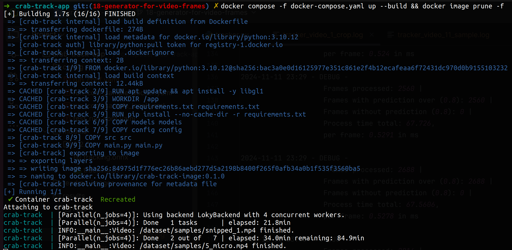

# Crab Tracker


[](https://github.com/mmartiasg/crab-track-app/actions/workflows/ci.yaml)


This Python application uses YOLO (You Only Look Once) from the `ultralytics` library to detect and track crabs in video feeds or images. YOLO is a real-time object detection system, and with the latest advancements in `ultralytics`, we can achieve efficient and accurate detection of crabs for research, environmental monitoring, or other applications.

## Table of Contents

- [Features](#features)
- [Installation](#installation)
- [Setup](#setup)
  - [Local](#local)
  - [Docker](#docker)
- [Usage](#usage)
  - [Local](#local)
  - [Docker](#docker)
  - [Console output](#console-output)
- [Output](#output)
  - [Files](#files)
  - [Csv data](#csv-data)

## Features

- Real-time crab detection using YOLO from the `ultralytics` library.
- Configurable for different image and video sources.
- Options to save detection results as videos.
- Adjustable parameters to improve detection accuracy.
- Missing points are interpolated using the previous and next points.
- The provided model **0.2.0** has been trained on 30,000 images for one week using a RTX 4070ti.

## Installation

1. **Clone the Repository**
   ```bash
   git clone https://github.com/mmartiasg/crab-track-app.git
   cd crab-track-app

## Setup

### Local
💡**Hint** Although this is not the recommended way to use the app, we have provided instructions for it. However, we encourage using Docker for optimal performance and consistency.

1. **Create a local environment**
    ```bash
      python3 -m venv /path/to/virtualenv/name_virtual_env
    ```
   Example:
    ```bash
      python3 -m venv ~/python_envs/crab-track
    ```

2. **Activate the environment**
   ```bash
      source /path/to/virtualenv/name_virtual_env/bin/activate
    ```
   Example:
    ```bash
      source ~/python_envs/crab-track/bin/activate
    ```

3. **Set Up the configuration file**
   ```yaml
      model:
        path: # Model weight's path.
        conf_threshold: # Desired confidence threshold from 0.0 up to 1.0.
        nms_threshold: # Desired iou overlap threshold from 0.0 up to 1.0.
        device: # Device cpu, cuda or mps.
      input:
        path: # Absolute path where the videos are located in the current file system.
        extension: mp4 # Video extension.
      resolution: # video resolution
        width: 1920
        height: 1080
      output:
        path: # Absolute path where the results will be saved in the current file system.
   ```

### Docker
  💡**Hint** Docker ensures the app runs consistently across environments, eliminating 'it works on my machine' issues, and provides a powerful, portable solution for efficient deployment, easy scaling, and optimized resource use.

  💡**Hint** Please note that this script utilizes all available resources in the Docker instance. If you allocate 4 vCPUs, the script will use all of them. Ensure approximately 0.5 GB of memory is allocated per vCPU.

  💡**Hint** Please note that the Docker image requires at least 2.5GB of available disk space and takes approximately 30 up to 50 seconds to build from scratch.

1. **Install Docker client**
Find your distribution installer here [Docker desktop](https://www.docker.com/products/docker-desktop/)

2. **Preapre the config file**
Copy the template provided for docker and change the name to **run_conf.yaml**
  ```bash
    cp config/run_conf_sample_docker.yaml config/run_conf.yaml
  ```

3. **Configuration**
   ```yaml
      model:
        path: # Model weight's path.
        conf_threshold: # Desired confidence threshold from 0.0 up to 1.0.
        nms_threshold: # Desired iou overlap threshold from 0.0 up to 1.0.
        device: # Device cpu, cuda or mps.
      input:
        path: /dataset/samples # !Do not change this! This is the docker path where the input will be mapped (target)!
        extension: mp4 # Video extension.
      resolution: # video resolution
        width: 1920
        height: 1080
      output:
        path: # Absolute path where the results will be saved in the current file system.
   ```

   💡**Hint:** We've provided a sample template for each case in the **config** folder to help you get started. A base model is also available in the models folder: the **ONNX** version is already optimized for fast **CPU inference**, while the .pt file is the unoptimized raw model from PyTorch.
    ```
    Project
    |-- README.md
    |-- config
       |-- run_conf_sample_docker.yaml
       |-- run_conf_sample_local.yaml
    |-- models
        |--0.2.0
            |-- tracking.onnx
            |-- tracking.pt
    ```

4. **Docker compose configuration**
The important part is the **volumes** section
   ```yaml
    volumes:
      - type: bind # Do not change!
        source: # Change to the folder in the local file system where the videos are located.
        target: /dataset/samples # Do not change!
      - type: bind # Do not change!
        source: # Change to an existing folder where you want the results to be saved.
        target: /results # Do not change!
   ```

## Usage
### Local
To run locally, specify the path to the YAML configuration file:

```bash
    python main.py --config_path=config/run_conf.yaml
```

### Docker
This command builds and runs the Docker image. Once the process is complete, the Docker container will be stopped:

```bash
      docker compose -f docker-compose.yaml up --build
```

By adding **docker image prune -f** we can clean up all the intermediate images produce by docker:
```bash
  docker compose -f docker-compose.yaml up --build && docker image prune -f
````

## Console output:


## Output
### Files
The output will be saved in the folder specified under **output -> path** for local runs, and in **volumes -> target** for Docker. A .csv file will be saved in the **'stats' folder**, and a video will be saved in the **'videos' folder** if **output -> export_videos** is set to **true**.

For example, if we have a single video called **1.mp4**, after the process is **complete**, you can find the following in the results folder:
```
Project
|-- README.md
|-- results
    |-- stats
        |-- 1.csv
    |-- videos
        |-- 1.mp4
```

### Csv data

| Index | pred_bbox_x1 | pred_bbox_y1 | pred_bbox_x2 | pred_bbox_y2 |
|-------|--------------|--------------|--------------|--------------|
| 0     | 1311         | 985          | 1526         | 1073         |
| 1     | 1312         | 983          | 1528         | 1072         |
| 2     | 1312         | 984          | 1526         | 1074         |
| 3     | 1313         | 982          | 1528         | 1072         |
| 4     | 1313         | 982          | 1528         | 1071         |
| 5     | 1312         | 983          | 1527         | 1073         |
| 6     | 1310         | 985          | 1525         | 1075         |

**Column Descriptions:**
- **Index**: The nth frame in the sequence.
- **pred_bbox_x1** and **pred_bbox_y1**: Upper-left corner coordinates of the bounding box.
- **pred_bbox_x2** and **pred_bbox_y2**: Lower-right corner coordinates of the bounding box.

### Logs
The script will output logs for the whole process and one per video

Those logs are stored in the output folder **results**


The main log will output information related to the whole process video, process or post process applied after:


The video logs will output information related to the process frames for that video:

